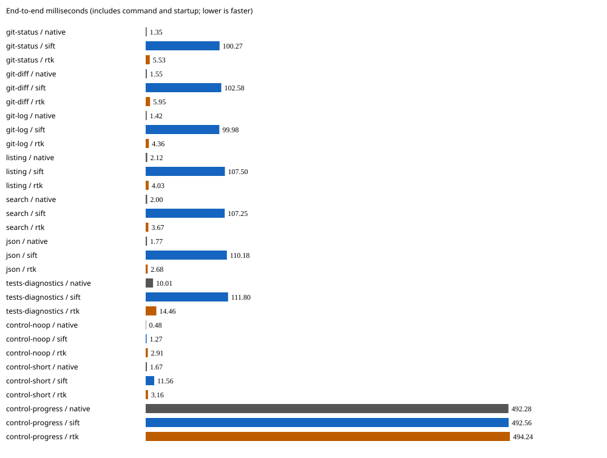

# Development v0.2.0 synthetic comparison — 2026-09-17

This is a **development release-mode Retok v0.2.0 binary, not a shipped artifact**.
Final source/release qualification is pending. These measurements do not establish
Retok as a faster RTK replacement: on the seven non-control workloads its medians
were about 100–112 ms, versus RTK's 2.7–14.5 ms. RTK emitted fewer tokens on six
workloads and tied on search, with differences in execution and representation
reported below. No aggregate winner is assigned.

## Identity and evidence

| Item | Version | SHA-256 |
| --- | --- | --- |
| Retok development binary | 0.2.0 | `fb9be54224069f898f8d88708af9930f389d782f89f6ba9783ce4dfbd8313eab` |
| RTK native binary | 0.49.0 | `dd97f3c0a08f91ed90d3e87e05520c448bfda112b3cb101847ccb4d5444c9b07` |
| Benchmark harness | recorded source | `1f0f1d413bbeca6ac81dd825d244791b7408f5a77242a1f12ffe7652f4ac266c` |

The run began at `2026-09-17T06:15:46.007615+00:00`. All binary hashes were unchanged after the run.
[Sanitized JSON](results.json) contains every measured sample, exact medians,
per-stream token counts/hashes, command audits and marker observations;
[CSV](results.csv) contains summaries. No raw transcripts, host identity or local
paths are included. Raw evidence remains local. The source evidence JSON SHA-256
is `46ec6144269e9622621dc9c8f8264c723ca5a05ba664138d643ea67128637d32`.

## Measurements

Tokens are ordinary `o200k_base` counts of actual emitted stdout plus stderr,
counted separately with the same warmed Retok tokenizer for every arm. All token
counts were stable across the five repeats. Times are milliseconds; whole-command
and warmed-processing measurements are distinct. The latter sums median round
trips for the original stdout and stderr through a warmed Retok compact protocol,
including Python serialization/pipe overhead; it is not an extracted CPU time.

| Workload | Native tokens | Retok tokens | RTK tokens | Native ms | Retok ms | RTK ms | Retok warm ms |
| --- | ---: | ---: | ---: | ---: | ---: | ---: | ---: |
| git-status | 144 | 144 | 43 | 1.349 | 100.270 | 5.534 | 0.128 |
| git-diff | 507 | 506 | 429 | 1.550 | 102.578 | 5.949 | 0.350 |
| git-log | 374 | 280 | 139 | 1.418 | 99.975 | 4.359 | 0.158 |
| listing | 429 | 249 | 187 | 2.119 | 107.496 | 4.026 | 0.218 |
| search | 138 | 138 | 138 | 2.000 | 107.255 | 3.666 | 0.061 |
| json | 962 | 320 | 40 | 1.773 | 110.180 | 2.677 | 0.654 |
| tests-diagnostics | 108 | 108 | 57 | 10.006 | 111.798 | 14.457 | 0.099 |
| control-noop | 0 | 0 | 0 | 0.484 | 1.271 | 2.906 | 0.024 |
| control-short | 2 | 2 | 2 | 1.667 | 11.560 | 3.158 | 0.031 |
| control-progress | 56 | 56 | 56 | 492.277 | 492.558 | 494.241 | 0.074 |

## Execution and retained information

All ten native and Retok audits observed the requested command exactly once with
unchanged argv/cwd and fixture contents. All timed exits matched: the deliberately
failing test workload returned 1 in every arm; other workloads returned 0. Every
Retok timed stream matched the exact native original or its explicit-encoding
candidate. Independent restore preserved text bytes exactly. The JSON rows
candidate preserved parsed values, types and numeric lexemes under an independent
Python `Number` check, but **did not preserve JSON formatting bytes**.

RTK's listing, test and proxy controls also passed the native invocation audit.
Its other workflows were different implementations or argv, so their measurements
must not be presented as identical native execution:

- Status ran `git status` and `git status --porcelain -b`; diff ran `git diff --stat`
  and `git diff`. All predeclared path/change markers remained in their output.
  Status used `M`, `D` and `??` codes and omitted full native headings/instructions.
  This does not imply the corresponding status distinctions were lost.
- Log used a custom pretty format; grep added native search/format flags. Both
  retained every selected literal marker. JSON produced no observed `cat` child;
  its output showed the first record plus an indication of 23 more records.
  `item-23` and `north` were absent, while `item-00` remained.
- Test output retained `validation_07`, `received 503`, and `11 passed`, but moved
  the native stderr diagnostic into stdout. Native child compatibility does not
  imply stream preservation or text reversibility.

Retok's encoded log omitted the literal `Adjust validation for item 5` and its
encoded listing omitted the literal `module_16.txt`; both restored exactly. Every
other predeclared Retok marker was present, as were all native markers. An absent
literal in reversible encoding is not evidence of lost information. The no-op
control had no markers. No reread cost, semantic-retention percentage or model
success result is inferred from these observations.

## Method and limitations

Seven modest synthetic workloads plus three fixed controls; one unmeasured
warmup per arm, five timed repeats, rotating arm order, warm filesystem caches.
The run used the required resource governor on a shared Linux host. End-to-end
times include process startup, command work and normal local tracking; minimum
and maximum samples are in the evidence. No-op and short-output controls describe
small-command cost without subtracting it from other rows. No memory, first-byte
latency, TTY behavior, agent turns or billing was measured. The same Retok tokenizer
counts all arms; this is not independent tiktoken verification.

Audit shims were used only in separate untimed checks. They observe PATH-launched
children, not every possible internal or absolute-path operation. Content hashes
include Git metadata, but not access times or identical rewrites. JSON formatting
normalization is permitted; numeric lexemes are compared without floating-point
conversion. Retok's runner bypasses streams below 256 bytes and can pass progress
through raw. RTK controls use `proxy`, not a filter. The test fixture is synthetic
printed output, not a real test-framework performance measurement. Native listing
owner/group names and Git relative dates can vary across machines or dates, so
reruns need not have identical output-token counts.

Two failed attempts are preserved separately, without pooling their samples:
(1) the native diff refreshed Git's index after fixture timestamp normalization;
setup now refreshes that stat cache before measuring, and (2) the harness wrongly
required byte-exact JSON restoration; it now checks the documented value/type/
numeric-lexeme contract and records byte equality separately. Workloads, payloads,
command matrix and repeat count were not retuned. Three focused harness checks
passed under the governor; the final complete matrix exited successfully.

See the [harness method](../../README.md) for reproduction instructions.
