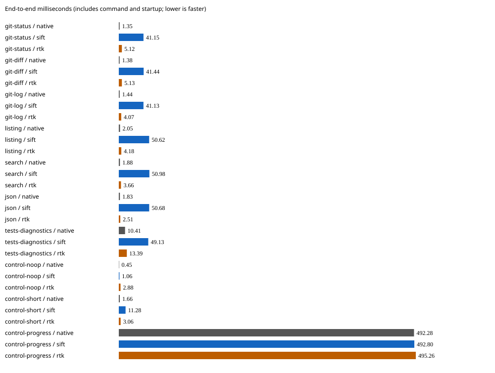
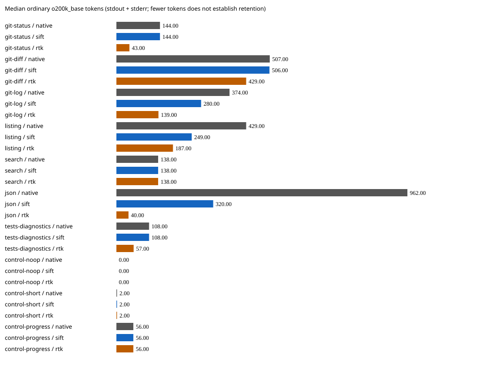

# Release v0.3.0 synthetic comparison — 2026-09-17

These measurements use the **final Linux x64 Retok v0.3.0 release binary**. RTK
remains faster on the seven non-control workloads: Retok took 41–51 ms, versus
RTK's 2.5–13.4 ms. RTK emitted fewer tokens on six workloads and tied on search.
Retok preserved the requested command, exit status and reversible output; RTK's
command-specific transformations differ, as detailed below. No aggregate winner
or model-task-success claim follows from these small fixtures.

## Identity and measurements

- Retok 0.3.0 SHA-256: `4019e56d8598c493e8e2d7c947529cfd3190fae56f0682ca06f0fc666976a494`
- RTK 0.49.0 SHA-256: `dd97f3c0a08f91ed90d3e87e05520c448bfda112b3cb101847ccb4d5444c9b07`
- Retok source: `64de3adb0d2813941dc3a3c8eb048c504f91978a`

Seven timed repeats per arm after one warmup, rotating arm order and warm filesystem
caches on a shared Linux host. Hashes were unchanged afterward. Times include
startup, child execution and local tracking. Tokens count actual stdout and stderr
separately as ordinary `o200k_base`, using the same warmed Retok tokenizer for all
arms. Counts were stable across repeats. This is not an independent tokenizer
comparison or a memory, billing, agent-success or first-byte-latency measurement.

| Workload | Native tokens | Retok tokens | RTK tokens | Native ms | Retok ms | RTK ms |
| --- | ---: | ---: | ---: | ---: | ---: | ---: |
| git-status | 144 | 144 | 43 | 1.351 | 41.155 | 5.119 |
| git-diff | 507 | 506 | 429 | 1.375 | 41.443 | 5.132 |
| git-log | 374 | 280 | 139 | 1.439 | 41.132 | 4.073 |
| listing | 429 | 249 | 187 | 2.046 | 50.618 | 4.182 |
| search | 138 | 138 | 138 | 1.885 | 50.981 | 3.656 |
| json | 962 | 320 | 40 | 1.830 | 50.683 | 2.514 |
| tests-diagnostics | 108 | 108 | 57 | 10.414 | 49.133 | 13.386 |
| control-noop | 0 | 0 | 0 | 0.454 | 1.063 | 2.879 |
| control-short | 2 | 2 | 2 | 1.660 | 11.283 | 3.057 |
| control-progress | 56 | 56 | 56 | 492.285 | 492.796 | 495.259 |

[Sanitized samples and command audits](results.json) retain all elapsed samples,
output hashes, token counts and marker checks; [CSV](results.csv) contains summaries.
Local paths, host identity and encoded payload text are omitted. These are synthetic
fixtures, never historical commands or user repositories.

## Execution and retention

All ten Retok workloads executed the requested command once with unchanged argv,
cwd and fixture contents. Timed exits matched native behavior, including the
intentional test failure. Every Retok stream matched the original or its explicit
encoding. Restoration uses Retok’s product decoder. Restored text is compared byte-for-byte;
JSON is compared independently for values, types and numeric lexemes while
permitting whitespace and object-key order changes.

RTK listing, tests and proxy controls passed the same native invocation audit.
Status and diff made additional or altered Git calls; log changed its format;
search changed flags. JSON used an internal reader and emitted the first record
plus a remaining-row count: the final record's marker was absent. Test output
moved the native stderr diagnostic into stdout. These observations describe the
actual representations, not inferred reread costs or semantic-retention scores.
Missing literal markers in Retok's reversible encoding restored correctly.

No-op and progress controls show passthrough behavior; RTK uses `proxy` for them.
Retok bypasses tiny output and streams progress after its capture window. The
separate warmed-protocol times in the JSON exclude tokenizer startup and include
serialization/pipe overhead; they are not comparable to whole-command RTK times.

See the [harness and complete method](../../README.md) for fixture definitions,
untimed PATH-shim audit limits, restoration rules and reproduction commands. The
[earlier v0.2.0 development run](../2026-09-17-development-v0.2.0/README.md) is retained;
its separate run is not a controlled before/after speed ratio.
